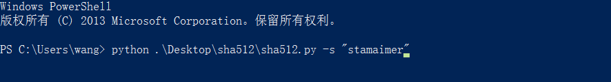
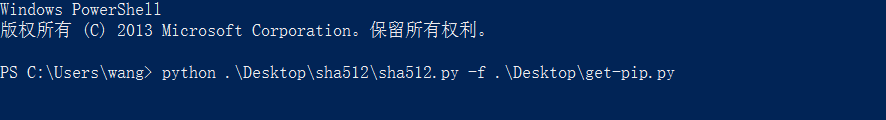
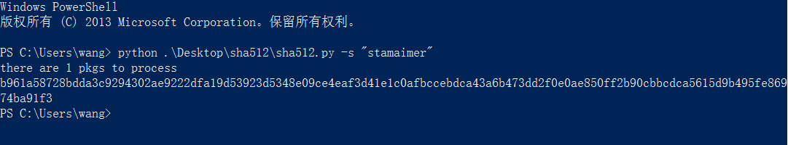

### SHA-512

*目标*

编写一个使用`SHA-512`算法计算数字信息信息摘要的程序

*使用语言以及运行环境*

- 使用Python语言编写
- Python 2.7.6

*使用说明*

1. 安装[`Python 2.7.6`](https://www.python.org/download/releases/2.7.6)
2. 设置`PATH`
3. 运行`cmd`或者`Windows PowerShell`
4. 输入`python path/to/sha512/sha512.py -s "str2hash"`  
     
   或者`python path/to/sha512/sha512.py -f path/to/file2hash`    
       
5. 回车
6. 输出

