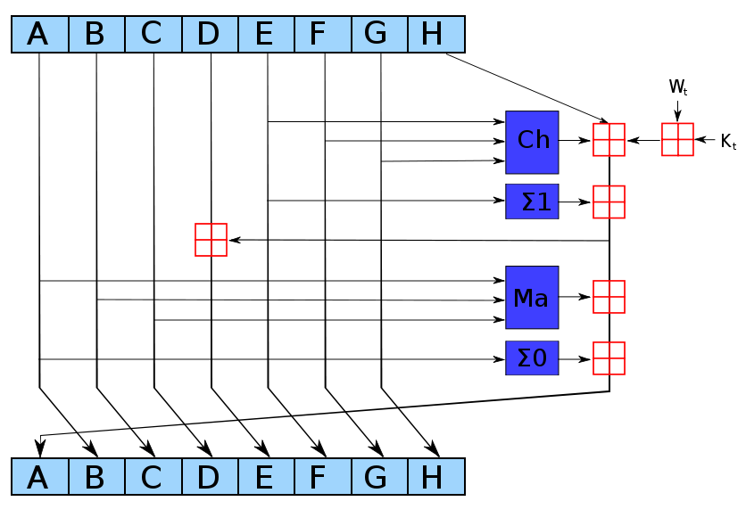
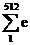
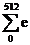
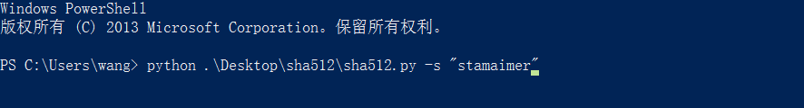
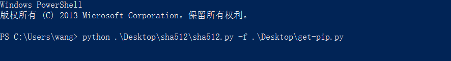
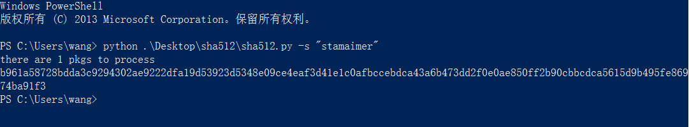

### SHA-512

#### 基本介绍

编写一个使用`SHA-512`算法计算数字信息的信息摘要的程序

安全散列算法（英语：Secure Hash Algorithm）一种计算一个数字信息所对应的，长度固定的字符串（又称信息摘要）的算法。且若输入信息不同，它们对应不同字符串的机率很高；SHA是FIPS认证的五种安全散列算法。这些算法之所以称作“安全”基于以下两点（根据官方标准描述）：

1. 根据信息摘要反推输入信息，理论上说很困难；
2. 想要找到两组不同信息对应相同信息摘要，理论上说很困难。输入信息的任何变动，都有很高机率导致信息摘要迥异。

SHA家族包含五个算法，分为SHA-1、SHA-224、SHA-256、SHA-384和SHA-512，均由美国国家安全局（NSA）设计，并由美国国家标准与技术研究院（NIST）发布；均是美国政府标准。靠后四者有时并称SHA-2。SHA-1在许多安全协议中广为使用，包括TLS和SSL、PGP、SSH和IPsec，曾被视为MD5的后继者。但是SHA-1的安全性如今受到密码学家严重质疑；虽然至今尚未出现针对SHA-2的有效攻击，但是它的算法与SHA-1基本相似；因此有人开始发展其他替代散列算法。缘于最近对SHA-1的种种攻击发表，“美国国家标准与技术研究院（NIST）开始设法经由公开竞争管道，发展一个或者多个新的散列算法。”

#### 算法描述

- 输入：最大长度小于2128比特的消息  
- 输出：512比特的散列值
- 步骤：  
    - 对消息进行填充。对原始消息进行填充使其长度与 896 模 1024 同余。即使原始消息已经满足上述长度要求，仍然需要进行填充，因此填充位数处于 1~1024 之间。填充部分由一个 1 和 0 组成。
          
    - 添加消息长度信息。填充消息之后，添加一个 128 位的块，用来说明原始消息长度。使用大端无符号整数表示。至此产生一个长度等于 N * 1024 的扩展消息。

    - 初始化HASH缓冲区。HASH函数计算的中间结果和最终结果保存在 512 位的缓冲区中，分别使用 64 位的寄存器(A,B,C,D,E,F,G,H)表示，并将这些寄存器初始化。初始值获取方式如下:前 8 个素数取平方根，取小数部分的前64位。

    - 以 1024 位分组（16 个字）为单位处理消息。处理算法的核心是需要进行 80 轮运算。每一轮均把 512 位缓冲区的值 ABCDEFGH 作为输入，同时更新缓冲区的值。每轮使用一个 64 比特的值 Wt (0 ≦ t ≦ 79) 该值由当前消息分组导出。导出算法称为`消息调度算法`。每轮还将使用常数 Kt (0 ≦ t ≦ 79) 这些常数如下获得：前 80 个素数取三次方根，取小数部分的前64位。这些常数可以消除输入数据的任何规则性。 

    - 输出。

- 消息调度算法 
  每轮使用的 Wt (0 ≦ t ≦ 79) 的导出算法如下：  

    - Wt (0 ≦ t ≦ 15) 直接取自当前消息分组的 16 个字。
    - 余下的值如下导出：  

          Wt = sigma1512(Wt-2) + Wt-7 + sigma0512(Wt-15) + Wt-16  

          其中  

          sigma0512(x) = ROTR1(x) + ROTR8(x) + SHR7(x);  

          sigma1512(x) = ROTR19(x) + ROTR61(x) + SHR6(x);  

          ROTRn(x)：对 64 位的变量 x 循环右移 n 位;

          SHRn(x)： 对 64 位的变量 x 向左移动 n 位，右边补零。  

- SHA-512的轮函数  

    SHA-512中的核心处理就是轮函数，它的定义如下：

      T1 = h + Ch(e, f, g) + () + Wt + Kt  

      T2 = () + Maj(a, b, c)    

      a = T1 + T2   
      b = a  
      c = b  
      d = c  
      e = d + T1    
      f = e  
      g = f  
      h = g  
  
- SHA-512运算总体可以描述如下：  

    H0 = IV;  
    Ht = SUM 64(Ht-1, ABCDEFGHt);  
    MD = HN.

#### 源码分析

主要变量列表  

- wbuffer[80] // 当前消息分组导出变量 Wt (0 ≦ t ≦ 79)    
- hbuffer[8]  // HASH 缓冲区
- kbuffer[80] // 常数 Kt (0 ≦ t ≦ 79) 

全部函数列表(以调用关系组织)

- sha512(str2hash) // 执行 SHA-512 算法
    - str2bin(str2convert) // 将字符串转化为二进制
    - pad(str2pad) // 对消息进行填充，添加消息长度信息
    - process(str2pro) // 以 1024 位分组（16 个字）为单位处理消息
        - gen(str2gen) // 使用消息调度算法初始化wbuffer
            - sigma0(var)
                - ror(str2ror, step)
                - shr(str2shr, step)
            - sigma1(var)
                - ror(str2ror, step)
                - shr(str2shr, step)
        - sigma2(var)
        - sigma3(var)
        - chr()
        - maj()
      
#### 使用语言以及运行环境

- 使用Python语言编写
- 运行环境——Python 2.7.6

#### 使用说明以及测试说明

1. 安装[`Python 2.7.6`](https://www.python.org/download/releases/2.7.6)
2. 设置`PATH`
3. 运行`cmd`或者`Windows PowerShell`
4. 输入`python path/to/sha512/sha512.py -s "str2hash"`  
     
   或者`python path/to/sha512/sha512.py -f path/to/file2hash`    
       
5. 回车
6. 输出

